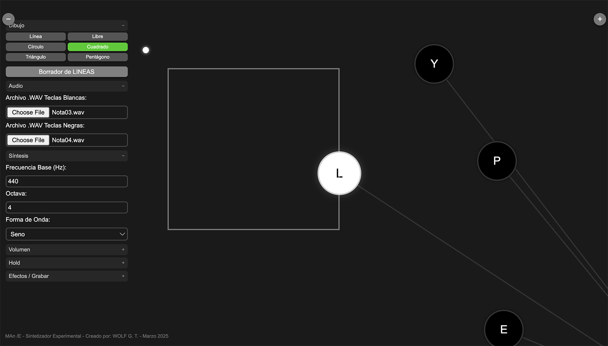
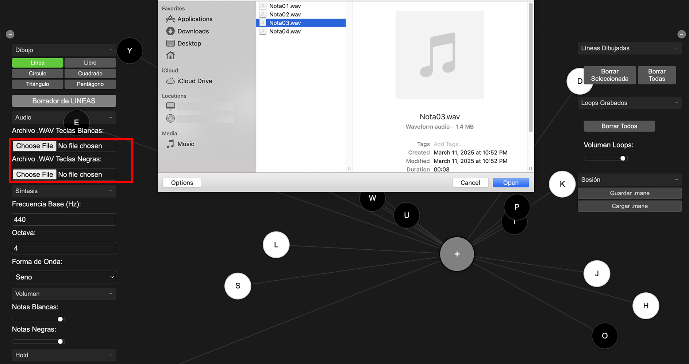
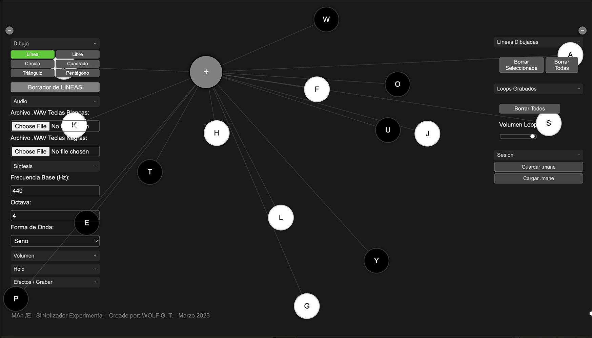
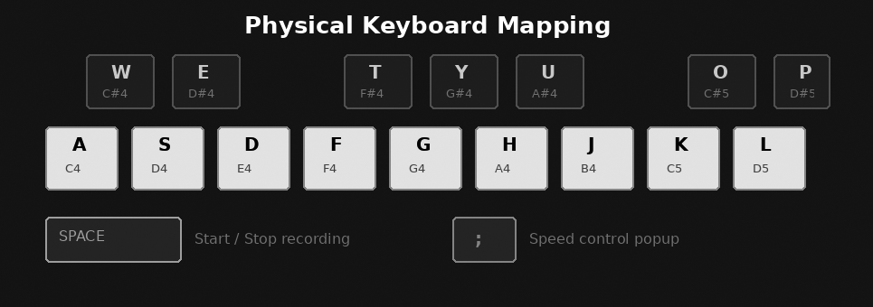

# WOLF-SYNTH

**Experimental Circular Synthesizer** — A visual-sonic performance tool where floating keys, drawn shapes, and real-time collision detection come together to create generative music.

Created by **WOLF G. T.** as part of the **MAn/E** art project — Medellín, Colombia, 2025.

🎹 **[Launch WOLF-SYNTH](https://wolfmedapps.github.io/wolf-synth/)**

---

## What Is This?

WOLF-SYNTH is not a conventional synthesizer. It is a visual instrument where musical notes are **floating keys** that drift across the screen, and **geometric shapes** drawn by the user act as sound triggers. When a floating key crosses a drawn line or collides with a shape, the corresponding note plays automatically. The result is a generative composition controlled by geometry and motion.

The instrument can also be played traditionally by clicking/touching keys directly or using a physical QWERTY keyboard.



---

## Quick Start



1. **Open** the app at [wolfmedapps.github.io/wolf-synth](https://wolfmedapps.github.io/wolf-synth/)
2. **Load audio** (optional) — Upload a `.WAV` file for white and/or black keys using the left panel. If no file is loaded, no sound will be produced by sample playback.
3. **Draw shapes** — Select a drawing tool (line, freehand, circle, square, triangle, pentagon) and draw on the canvas by clicking/touching and dragging.
4. **Listen** — Watch the floating keys collide with your shapes. Each collision triggers the corresponding note.
5. **Record** — Press `SPACE` on a physical keyboard or tap the `Record` button to capture a loop of your performance.
6. **Save** — Save your entire session (settings, shapes, audio, loops) as a `.mane` file to restore later.

---

## Interface



### Left Panel — Controls

| Section | Description |
|---------|-------------|
| **Drawing Tools** | Select shape type: Line, Freehand, Circle, Square, Triangle, Pentagon. Toggle eraser mode. |
| **Audio** | Load `.WAV` sample files for white keys and black keys independently. |
| **Synthesis** | Set base frequency (Hz), octave (1–8), and waveform (sine, square, sawtooth, triangle). |
| **Volume** | Independent volume sliders for white and black keys. |
| **Hold** | Enable sustained notes for white and/or black keys. When active, notes continue playing after collision or keypress until manually toggled off. |
| **Effects / Record** | Toggle **MAn/E R-Verb** (algorithmic convolution reverb). Start/stop loop recording. |

### Center — Performance Area

The main canvas where everything happens:

- **Floating keys** drift autonomously and bounce off screen edges.
- **Drawn shapes** appear as SVG overlays.
- **Collision detection** runs every frame — when a key intersects a shape, the note plays; when it leaves, the note stops.
- **Connection lines** are rendered on a canvas layer between keys.

### Right Panel — Management

| Section | Description |
|---------|-------------|
| **Drawn Shapes** | Lists all shapes on the canvas. Select to highlight, delete individually or clear all. |
| **Recorded Loops** | Lists captured loops. Click a loop name to play/stop. Arrow button exports as `.WAV`. Global volume slider for all loops. |
| **Session** | Save the complete state as a `.mane` file or load a previous session. |

### Collapsible Panels

Both panels can be collapsed using the `−` buttons on either side of the screen to maximize the performance area.

---

## Keyboard Mapping

When using a physical keyboard (desktop or Bluetooth on iPad):



### White Keys (Natural Notes)

| Key | Note |
|-----|------|
| `A` | C4 |
| `S` | D4 |
| `D` | E4 |
| `F` | F4 |
| `G` | G4 |
| `H` | A4 |
| `J` | B4 |
| `K` | C5 |
| `L` | D5 |

### Black Keys (Sharps)

| Key | Note |
|-----|------|
| `W` | C#4 |
| `E` | D#4 |
| `T` | F#4 |
| `Y` | G#4 |
| `U` | A#4 |
| `O` | C#5 |
| `P` | D#5 |

### Special Keys

| Key | Function |
|-----|----------|
| `SPACE` | Start / Stop loop recording |
| `;` | Open speed control popup (adjust floating key velocity) |

---

## Features in Detail

### Dual Audio Engine

WOLF-SYNTH supports two sound generation methods:

- **Sample playback:** Load any `.WAV` file and it will be chromatically pitched across all keys using `playbackRate` and `detune`. White and black keys can use different samples.
- **Synthesis:** If no sample is loaded, the synth can use pure waveform generation (sine, square, sawtooth, triangle) at the configured frequency and octave.

### Drawing Tools

Six shape tools are available for creating collision triggers:

- **Line** — Straight line from point A to B.
- **Freehand** — Draw freely with continuous points.
- **Circle** — Ellipse defined by drag radius.
- **Square** — Rectangle defined by drag dimensions.
- **Triangle** — Equilateral triangle fitted to drag area.
- **Pentagon** — Regular pentagon fitted to drag area.

Shapes with Shift held constrain proportions. Shapes smaller than 5px are automatically discarded (accidental clicks).

### Collision System

Every animation frame, the engine checks whether each floating key's position overlaps with any drawn shape:

- **Collision detected** → note plays (with attack envelope).
- **Collision ends** → note stops (with release envelope).
- **Hold mode** → note sustains even after collision ends, until Hold is toggled off.
- **Manual override** → clicking/touching a key directly always works, independent of collision state.

### MAn/E R-Verb

A custom convolution reverb effect generated algorithmically:

- Stereo impulse response (1.5 second decay).
- Exponential decay envelope with randomized noise.
- 70/30 dry/wet mix when active.
- Toggleable on/off without interrupting playback.

### Loop Recording

- Records the complete audio output of the synthesizer.
- Automatic 150ms silence buffer at start to prevent click artifacts.
- Smooth fade-in/out on recording boundaries.
- Crossfade applied to loop points for seamless repetition.
- Multiple loops can play simultaneously.
- Each loop can be exported individually as a `.WAV` file.

### Session Management (.mane format)

The `.mane` file format saves and restores the complete state:

- All synthesis parameters (frequency, octave, waveform, volumes, hold states).
- Key animation speeds.
- Reverb state.
- All drawn shapes (normalized to viewport for resolution independence).
- Loaded audio samples (embedded as Base64 WAV).
- All recorded loops (embedded as Base64 WAV).

---

## iPad / Mobile Usage

WOLF-SYNTH is a Progressive Web App (PWA) that works as a native-like app on iPad:

1. Open **https://wolfmedapps.github.io/wolf-synth/** in **Safari**.
2. Tap the Share button (⬆) → **"Add to Home Screen"**.
3. The app appears with its own icon and runs in full screen.

**Offline support:** After the first load, the Service Worker caches all files so the app works without internet.

**Touch:** The app translates touch events to mouse events for full touch compatibility. All controls, drawing tools, and keys respond to touch input.

**Bluetooth keyboard:** Connect a keyboard to your iPad for the full physical keyboard experience with chromatic note mapping.

---

## Technical Architecture

- **Zero dependencies** — No frameworks, no libraries, no build tools.
- **Single-file logic** — All code in `script.js`, styles in `styles.css`, structure in `index.html`.
- **Web Audio API** — Synthesis, sample playback, gain envelopes, convolution reverb, MediaRecorder.
- **Canvas 2D** — Connection lines between floating keys.
- **Dynamic SVG** — All drawn shapes created and manipulated as SVG elements.
- **Touch polyfill** — Transparent touch-to-mouse translation for mobile compatibility.
- **Service Worker** — Offline caching for PWA support.

---

## Project Files

```
wolf-synth/
├── index.html        UI structure and layout
├── script.js         Complete logic (audio, drawing, collision, recording)
├── styles.css        Visual styling and responsive layout
├── manifest.json     PWA configuration
├── sw.js             Service Worker for offline support
├── icon-192.png      App icon (192×192)
├── icon-512.png      App icon (512×512)
└── assets/           README diagrams
    ├── how-it-works.png
    ├── interface-layout.png
    ├── keyboard-mapping.png
    └── quick-start.png
```

---

## About MAn/E

**MAn/E** is an experimental music and digital art project based in Medellín, Colombia. WOLF-SYNTH is one of several custom-built software tools created for live performance, where code and interface are integral to artistic expression.

---

*WOLF-SYNTH — MAn/E — 2025*
